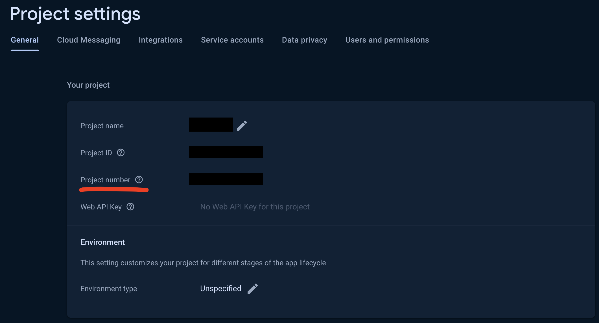

### General usage as `.aar` file

#### Including the dependency

Include the following dependencies in your application `build.gradle` file

```groovy
dependencies {
// ... your dependencies

// Collector dependencies
implementation 'com.google.code.gson:gson:2.10.1'  
implementation 'com.google.android.gms:play-services-location:21.0.1'  
implementation 'org.jetbrains.kotlinx:kotlinx-coroutines-android:1.6.4'  
implementation 'com.squareup.okhttp3:okhttp:4.11.0'  
implementation 'com.squareup.moshi:moshi-kotlin:1.14.0'  
implementation 'com.google.android.gms:play-services-safetynet:18.0.1'  
implementation 'com.google.guava:guava:31.0.1-jre'  

// Optional Huawei location dependency
implementation 'com.huawei.hms:location:6.12.0.300'  

// Optional Play Integrity dependency
implementation 'com.google.android.play:integrity:1.4.0'

// Optional dnsjava dependency in cases we see dns lookup issues
implementation 'dnsjava:dnsjava:3.6.1'

// Collector dependency
implementation files('libs/collector-release.aar')
}
```

The collector uses, but doesn't require the following permissions in the `AndroidManifest.xml`. Please make sure to include the ones you think are appropriate for your application [Collector manifest permissions and usage](/manifest)

#### Usage in code

 
```kotlin
class MyApp: Application() {
	private val BASE_URL = "base url provided by us"
	private val CID = "customer id provided by us"
	
	fun onCreate() {
		// It is preferred that the collector SDK is initialized from the Application class, but it can be initialized from any place before the SDK is used
		val collector = CollectorAgent.initialize(this, BASE_URL, CID)

		// mainly used to print the logs into logcat for debugging
		collector.isDebug = false
	}
}
```

```kotlin
val collector = CollectorAgent.get()

// call when the user session id is updated or available
collector.setCSID(CSID)

// call when the user id is updated or available
collector.setUserID(UserID)

// call when the state of the application is changed. Different contexts can trigger different state updates inside the SDK
collector.sendContext("CONTEXT")
```


### Play Integrity Integration

The SDK is using the play integrity to utilize built in android security features. To use those features you have to configure the Play Integrity on the platform, which would include sharing the cloud project number and creating.

To retrieve that info you have to go to your firebase console and open the project settings. <https://console.firebase.google.com/>
The project number will be under the `General` tab


We also need a service account private key to make requests to google on your behalf for retrieving additional information regarding suspicious activity on the device. You can generate the private key from firebase.


Then you'll have to enable Play Integrity from the google console
<https://console.cloud.google.com/marketplace/product/google/playintegrity.googleapis.com> for your selected project.
