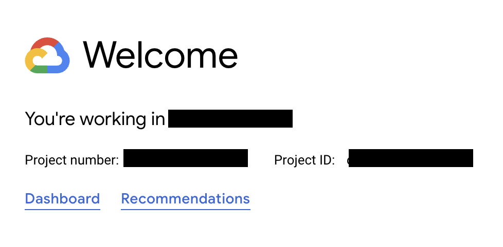
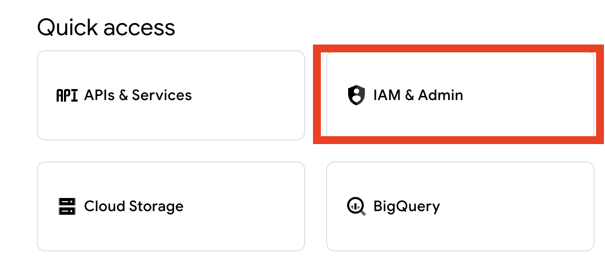
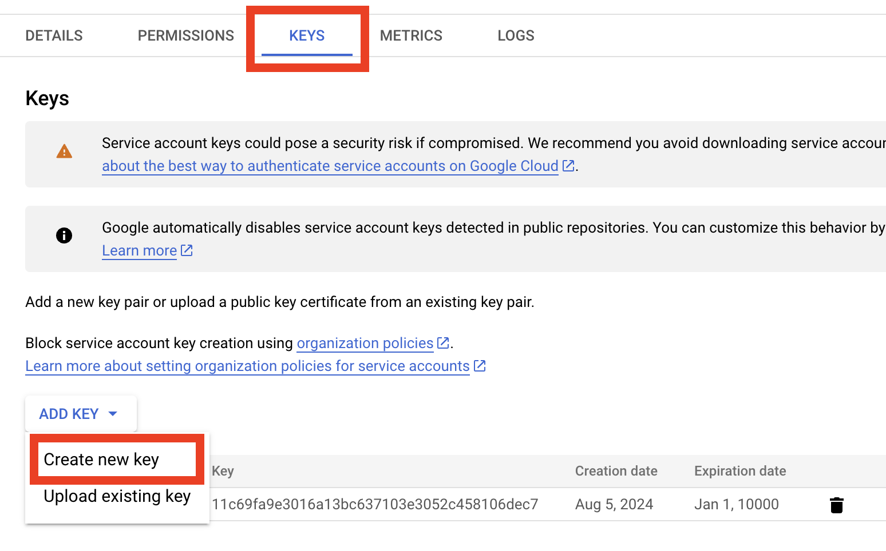
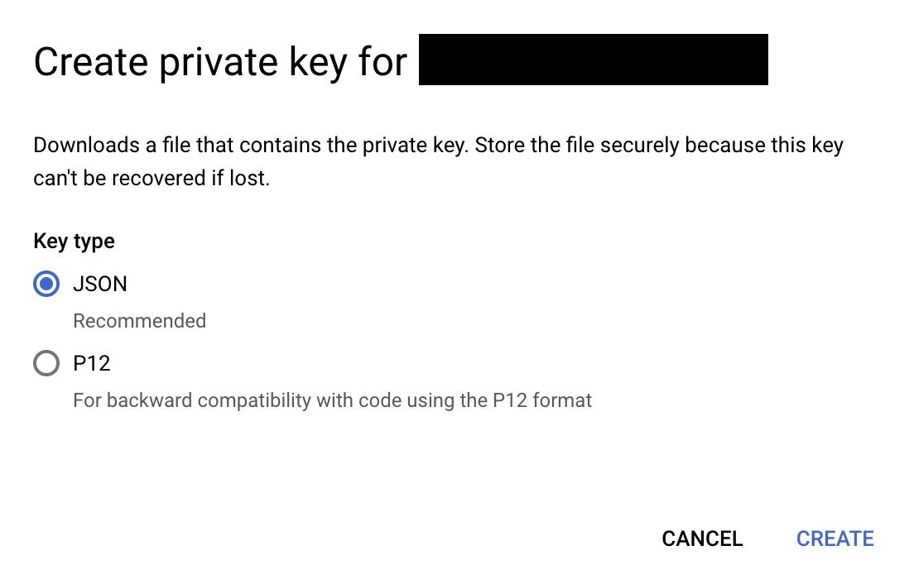

The SDK is using the play integrity to utilize built in android security features. To use those features you have to configure the Play Integrity on the platform, which would include sharing the cloud project number and creating a key.

To be able to use the feature, you need to add the following dependency to your `build.gradle` file:

```
dependencies {
	// ...
	implementation 'com.google.android.play:integrity:1.4.0'
}
```

### Using Firebase

Firebase is a convenient way to ensure we have all the data to perform Play Integrity tests.

To retrieve the neccessary info you have to go to your firebase console and open the project settings. <https://console.firebase.google.com/>
The project number will be under the `General` tab


We also need a service account private key to make requests to google on your behalf for retrieving additional information regarding suspicious activity on the device. You can generate the private key from firebase.


Then you'll have to enable Play Integrity from the google console
<https://console.cloud.google.com/marketplace/product/google/playintegrity.googleapis.com> for your selected project.

### Using Google Cloud Console

You can also get all the neccessary info from the Google Cloud Console. <https://console.cloud.google.com>

The project number will be right on the home page with the name of your project.


To generate the key there is some navigation to perform.

1. First go to the IAM & Admin page by clicking this navigation button


2. Then select `Service Accounts` from the navigation bar.


3. Inside your service account, go to the Keys tab and create a new Key


4. Select JSON as the key type


