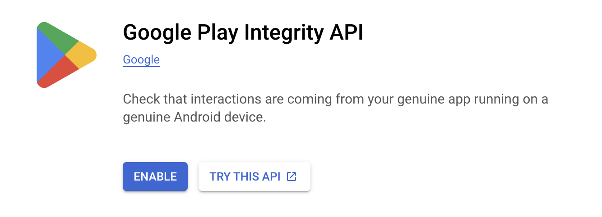
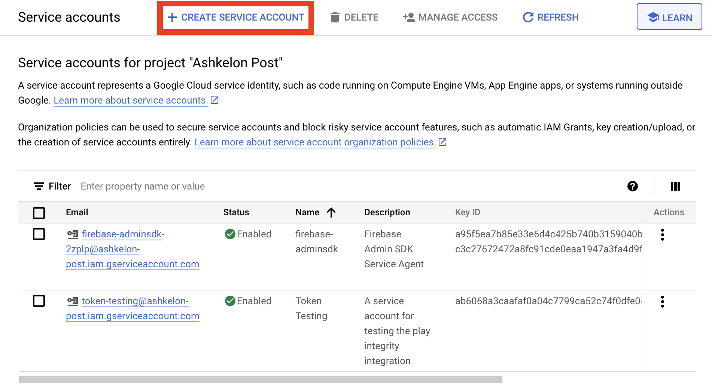
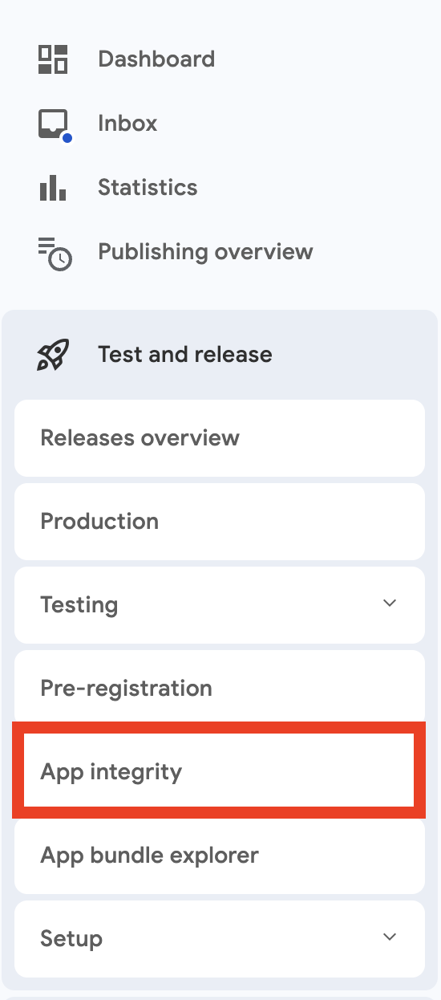
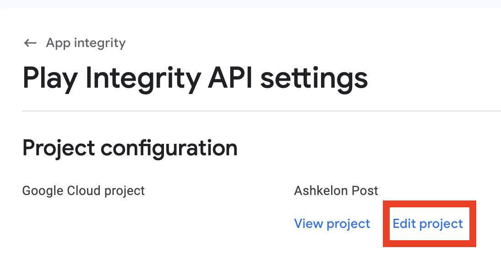
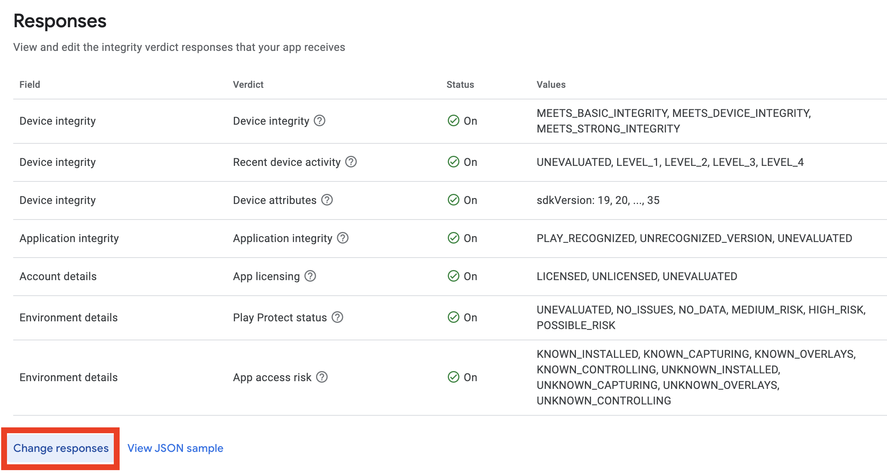

The SDK is using the play integrity to utilize built in android security features. To use those features you have to configure the Play Integrity on the platform, which would include sharing the cloud project number and creating a key.

To be able to use the feature, you need to add the following dependency to your `build.gradle` file:

```
dependencies {
	// ...
	implementation 'com.google.android.play:integrity:1.4.0'
}
```

### Enabling the feature in Google Play Console

Also the feature has to be enabled in the Goole Play Console for your project.



### Get Project Info

Get all the neccessary info from the Google Cloud Console. <https://console.cloud.google.com>

The project number will be right on the home page with the name of your project.


You'll also need to provide the Application Id.

### Create a new Service Account

1. First go to the IAM & Admin page by clicking this navigation button


2. Then select `Service Accounts` from the navigation bar.


3. Click on the `Create Service Account` button.


4. Make sure to give all the neccessary permissions and provide a meaningful name.

### Create a Private Key

1. Inside your service account, go to the Keys tab and create a new Key


2. Select JSON as the key type


### In Google Play Console

1. Open the Play Integrity in the navigation.


2. Link Google Cloud Project.


3. Enable Play Integrity Collection.


