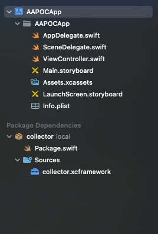

## Adding dependencies using swift package manager

You'll recieve zip file containing the Swift Package. Complete the following steps to import the framework into your Xcode project:

- Download the .zip which contains Collector Framework
- Unzip the contents of the zip file
- Move "Collector" folder inside your project. 


Next steps:
- Open your project in XCode
- Select Project, Open Project Settings, Switch to Package Dependencies & Click add (+) 


- Click "Add Local" (Image below).
- Select the package that you just moved to your project (Image below).
- Now, Select all packages & select Target in which you wish to add those packages
- After import you should see the "collector" in the project structure. 



## Linking and Embedding the SDK Framework

Ensure that the dependency is available to your application, Open Project settings, select target, switch to General Tab & make sure that dependency is added.

## Application code

The general collector allows for using the camera along with some sensor collecting.

You can start listening and collecting sensor events like this:

```swift
Collector.shared.initialize(cid: cid, baseUrl: baseUrl, csid: csid, userID: username)
Collector.shared.startListeningToEvents()
Collector.shared.collect()
```

`cid` = Customer Specific Identifier. This identifier will be provided by IronVest
baseUrl = This baseUrl will be provided by IronVest

`csid` = Customer Session Identifier. Usually it's a unique session identifier for each user session. This is the identifier by which the session can be queried during validation or looked for in the dashboard

`userID` = Unique User Identifier.

## Troubleshooting
The SDK generates logs throughout its execution. The most recent logs are stored in memory and can be retrieved for problems troubleshooting. Below is an example of how these logs can be put in a variable or in the Pasteboard to be shared with someone else.

```
// Example 1: Collecting Logs in a variable
var sdkLogs = Collector.shared.getLogs()
```

```
// Example 2: Collecting logs into Pasteboard & App-User can paste it anywhere (whatsapp, mail, telegram etc)
UIPasteboard.general.string = Collector.shared.getLogs()
```

