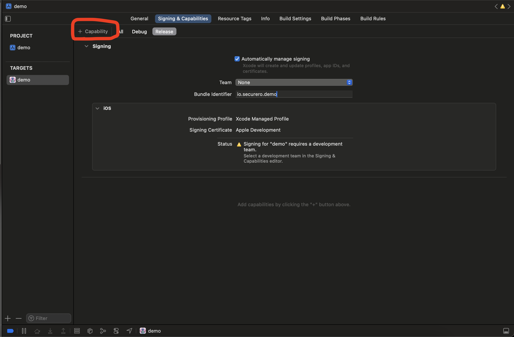
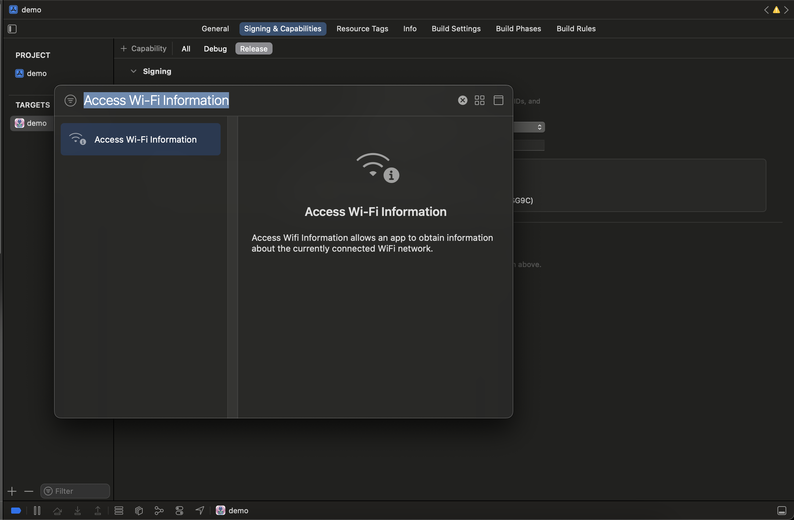

**These are the permissions that the iOS collector expects the consumer application to have.**

```
<key>NSFaceIDUsageDescription</key>
<string>Fraud detection measure. Used to detect if the user used face id instead of email/password combination to login into the app. The real owner of the device is likely using faceid.</string>
```

```
<key>NSLocalNetworkUsageDescription</key>
<string>Fraud detection measure. Checking if the device is in the usual network the app usage is happening.</string>
```

**Please use one of the following location permissions to the collector to be able to collect the user location. This permission ensures that the user is using the application from regular locations.**

```
<key>NSLocationUsageDescription</key>
<string>Deteting if the user is using the application from regular locations.</string>
```

```
<key>NSLocationUsageDescription</key>
<string>Deteting if the user is using the application from regular locations.</string>
```

```
<key>NSLocationAlwaysUsageDescription</key>
<string>Deteting if the user is using the application from regular locations.</string>
```

```
<key>NSLocationAlwaysAndWhenInUseUsageDescription</key>
<string>Deteting if the user is using the application from regular locations.</string>
```

```
<key>NSLocationWhenInUseUsageDescription</key>
<string>Deteting if the user is using the application from regular locations.</string>
```

**You also need to add wifi the Access Wi-Fi infromation capability**




